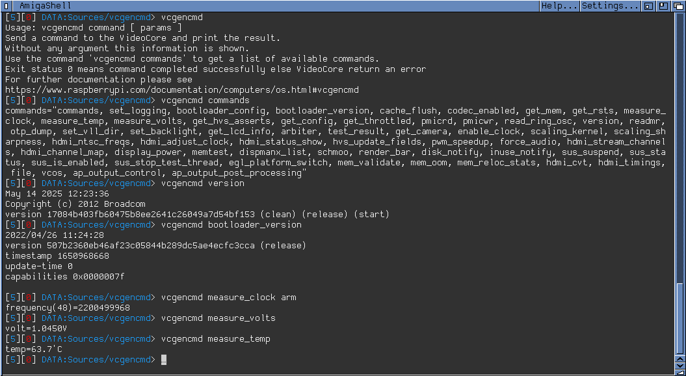

# vcgencmd for AmigaOS 3.x (PiStorm / Emu68)



`vcgencmd` sends a command to the Raspberry Pi **VideoCore** firmware and prints
the answer. It is a native AmigaOS 3.x port of the well-known Raspberry Pi
utility, built for Amigas running the **Emu68** emulator on a **PiStorm**.

With it you can read the SoC temperature, the core voltage, the current clock
frequencies, the firmware version, the memory split and much more, directly
from AmigaShell.

## Official documentation

This program forwards your command to the same VideoCore firmware interface as
the original Raspberry Pi tool, so the official documentation applies as is:

- **Command reference:** <https://www.raspberrypi.com/documentation/computers/os.html#vcgencmd>
- **Original source code:** <https://github.com/raspberrypi/utils/tree/master/vcgencmd>

Run `vcgencmd commands` to see which commands your firmware supports.

## Requirements

- An Amiga running **AmigaOS 3.x** (any 68k-compatible setup where Emu68 runs).
- A **PiStorm** with the **Emu68** emulator, version **1.1 or newer**
  (`mailbox.resource` is not available in earlier versions).
- `mailbox.resource` and `devicetree.resource`, both provided by Emu68.
  If one of them is missing, the program prints `Cant open <name>` and exits
  with `RETURN_FAIL`.

## Installation

Copy the `vcgencmd` executable to a directory in your command path, for example

```
Copy vcgencmd C:
```

## Usage

```
vcgencmd <command> [params]
```

The whole rest of the command line is passed to the VideoCore, so no quoting is
needed for commands with parameters. Running `vcgencmd` without any argument
prints a short help text.

### Examples

```
1> vcgencmd measure_temp
temp=63.7'C

1> vcgencmd measure_volts
volt=1.0450V

1> vcgencmd measure_clock arm
frequency(48)=2200499968

1> vcgencmd version
May 14 2025 12:23:36
Copyright (c) 2012 Broadcom
version 17084b403fb60475b8ee2641c26049a7d54bf153 (clean) (release) (start)

1> vcgencmd bootloader_version
2022/04/26 11:24:28
version 507b2360eb46af23c05844b289dc5ae4ecfc3cca (release)
timestamp 1650960668
update-time 0
capabilities 0x0000007f
```

### Commonly useful commands

| Command                | Description                                            |
|------------------------|--------------------------------------------------------|
| `commands`             | List every command known to the firmware               |
| `measure_temp`         | SoC temperature                                        |
| `measure_clock <clk>`  | Clock frequency in Hz (`arm`, `core`, `h264`, `emmc`…) |
| `measure_volts [blk]`  | Voltage of a block (`core`, `sdram_c`, `sdram_i`…)     |
| `get_throttled`        | Throttling / under-voltage status bit pattern          |
| `get_mem arm|gpu`      | Memory addressable by the ARM side or the GPU          |
| `get_config <name>`    | Value of a firmware configuration setting              |
| `version`              | Firmware build date and version                        |
| `bootloader_version`   | Bootloader build information                           |

Available commands and their output depend on your Raspberry Pi model and
firmware version. See the official documentation linked above for details.

### Return codes

| Code | AmigaDOS constant | Meaning                                  |
|------|-------------------|------------------------------------------|
| 0    | `RETURN_OK`       | Command completed successfully           |
| 5    | `RETURN_WARN`     | The VideoCore reported an error          |
| 20   | `RETURN_FAIL`     | Required Emu68 resources could not be opened |

This makes the tool easy to use in scripts, for instance with `IF WARN`.

## Building from source

The project is written in C for the **SAS/C 6.59** compiler.

```
cd src
smake
```

The `src` drawer contains `SMakeFile` and `SCOPTIONS`. Building requires the
Emu68 `mailbox.resource` and `devicetree.resource` headers and prototypes
(`proto/mailbox.h`, `proto/devicetree.h`) in your include path.

## Credits

- Original `vcgencmd` by Raspberry Pi Ltd.
- AmigaOS port by Michal Schulz and Philippe CARPENTIER.

## License

_To be defined before release._
